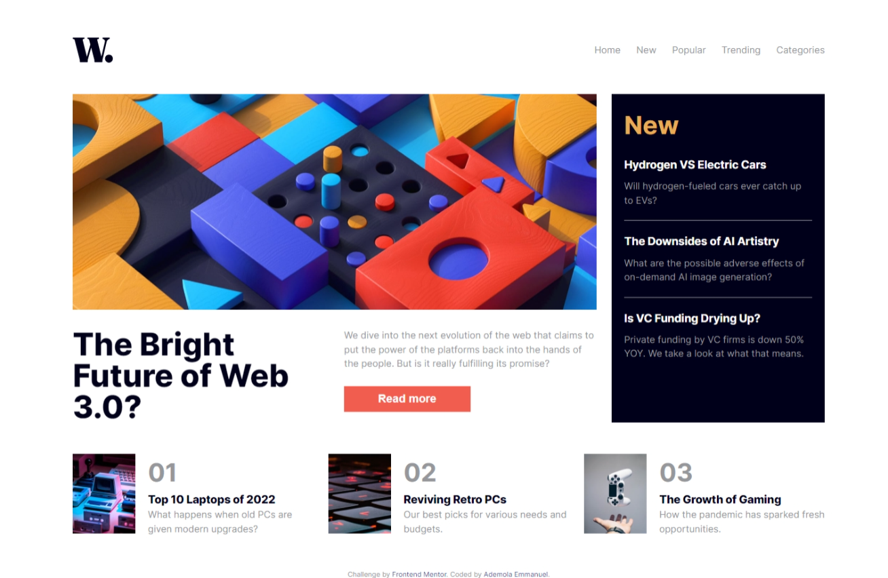
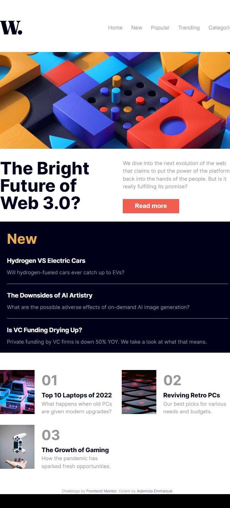
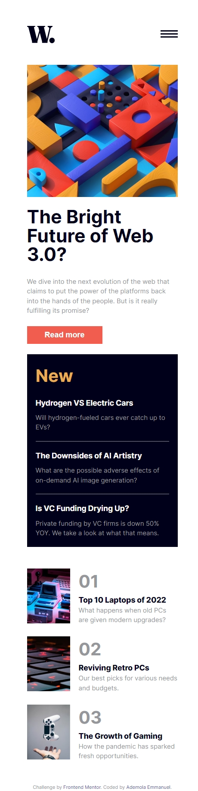

# Frontend Mentor - News homepage solution

This is a solution to the [News homepage challenge on Frontend Mentor](https://www.frontendmentor.io/challenges/news-homepage-H6SWTa1MFl). Frontend Mentor challenges help you improve your coding skills by building realistic projects. 

## Table of contents

- [Overview](#overview)
  - [The challenge](#the-challenge)
  - [Screenshot](#screenshot)
  - [Links](#links)
- [My process](#my-process)
  - [Built with](#built-with)
  - [What I learned](#what-i-learned)
  - [Continued development](#continued-development)
- [Author](#author)
- [Acknowledgments](#acknowledgments)

## Overview
I just conclude a project from frontend mentor(News home page), it requires css grid and also a little bit of flex, good structure of HTML5 Semantic markup, and javascript DOM malnipulation
### The challenge

Users will be able to:

- View the optimal layout for the interface depending on their device's screen size
- See hover and focus states for all interactive elements on the page
- interact with the webpage 

### Screenshot

## My process

### Built with

- Semantic HTML5 markup
- CSS custom properties
- CSS media query 
- Flexbox
- CSS Grid
- JavaScript

### What I learned

I learnt more on how to structure my webpage though not still the best, Css grid, flexbox, media queries, javascript event listener and more...

### Continued development

Next i will like to focus more on media queries html semantic markup, javascript dom malpulation and more...

## Author

- Website - [Add your name here](https://github.com/codingrot17)
- Frontend Mentor - [@codingrot17](https://www.frontendmentor.io/profile/codingrot17)
- Twitter - [@Emmanuel0808177](https://twitter.com/Emmanuel0808177)

## Acknowledgments

Thanks to Almighty God for the privillege he gave to me to bring this project into conclusion, i thank all my teachers at neovarsity africa for the knowledge the have shared with and the advice, thank to my parents who support me  also thanks to frontendmentor who also challenge me greate project and everyone else who try to add values to me